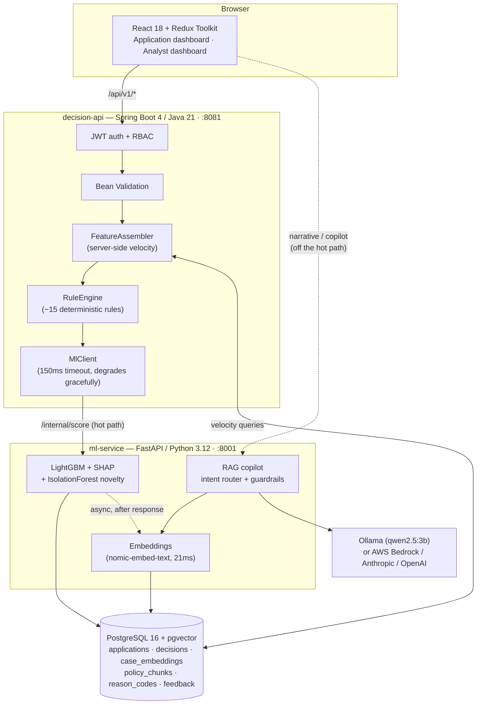

# VIGIL — Real-Time Fraud Detection & Prevention for Indian Digital Lending

**Synchrony Solution Development Challenge · PS-II 2026-27 · Roll 2022B2A81416G**

VIGIL is a real-time fraud decisioning platform for digital lending in India. A LightGBM model
scores every loan application in milliseconds, SHAP explains each score, and a retrieval-augmented
LLM copilot answers analyst questions **strictly from retrieved case data** — never from parametric
guesswork. Decisions route to one of four actions (Approve / Step-up verification / Review /
Decline) instead of a binary accept-reject, cutting hard declines without letting fraud through.

---

## Table of contents

- [Why this design](#why-this-design)
- [Architecture](#architecture)
- [Quick start](#quick-start)
- [The dataset the model trains on](#the-dataset-the-model-trains-on)
- [API reference](#api-reference)
- [Security](#security)
- [Responsible AI](#responsible-ai)
- [Testing](#testing)
- [Repository layout](#repository-layout)

---

## Why this design

**The problem statement asks for four things, and each is something you can point at, not just
read about:**

| Requirement | Where to see it |
|---|---|
| **Real-time** | `/api/v1/applications` responds in **p95 ≈ 99ms** end-to-end (measured, see [Testing](#testing)). The LLM is never on this path. |
| **Self-learning** | `POST /api/v1/models/retrain` (ADMIN only) rebuilds the model from the dataset + every `analyst_feedback` row at higher sample weight, and **hot-swaps only if the new holdout PR-AUC ≥ the incumbent's**. Measured directly: one analyst-confirmed case moved a held-out fraud pattern's score from **0.000 → 0.714** after a single retrain. |
| **Fewer false positives** | Four actions, not two — `STEP_UP` and `REVIEW` absorb the grey zone that a binary threshold would hard-decline. Live on the Analyst dashboard: binary decline 3.48% → four-way 3.46%, binary FP rate 0.023% → four-way 0.012%. |
| **Adapts to new fraud vectors** | An `IsolationForest` novelty channel runs in parallel with the supervised model, deliberately **not blended** into the risk score. The "New bot ring" scenario in the Application dashboard scores **risk=0.000, anomaly=0.949** — the supervised model fully misses it, the novelty channel screams. |

**Fraud-ring detection, live**: submitting several applications that share a device/bank/mobile
hash — or merely a *similar behavioural signature with every identifier rotated* — gets them grouped
into a `fraud_ring` row via pgvector cosine-distance clustering (`services/ml-service/app/rings.py`),
surfaced as a ring chip on the case detail view with member count and detection method
(`shared_identifier` vs `behavioural_embedding_only`). Both paths are covered by `test_rings.py`.

**Why LightGBM, not a deep model.** Tabular, heterogeneous, moderately sized data (60k rows,
~40 features) is exactly LightGBM's strength, it trains in seconds (enabling the retrain-on-feedback
story), and it gives exact feature attributions via SHAP without a separate explainability pipeline.

**Why the LLM only renders prose.** The architectural invariant that the whole system is built
around: **the LLM never produces a score, a decision, or a reason code.** It renders a narrative from
a payload that has already been retrieved and decided, and every output is validated before it
reaches an analyst — see [Responsible AI](#responsible-ai).

**Why a synthetic data generator, not a public dataset.** We evaluated three public benchmarks
(a Kaggle loan-fraud set, a Kaggle payment-fraud set, and the Feedzai Bank Account Fraud suite) and
rejected all three — full writeup in `docs/dataset-audit.md`. In short: one had a post-outcome
feature leaking the label (AUC 1.0000), one had no entity-linkage fields so ring detection is
impossible, and the third is licensed non-commercially and isn't Indian. A rule-based generator with
correlated, typology-specific signal blocks was the only way to get a demonstrable fraud ring, Indian
regulatory fields, and a held-out novel typology for the adaptation story.

---

## Architecture



**Request path and latency budget** (`POST /api/v1/applications`, target p95 < 150ms):

```
JWT verify + bean validation ........ 2ms
Velocity SQL (device/IP/bank/mobile) . 8ms
RuleEngine (in-memory) .............. <1ms
ml-service /internal/score .......... 30-55ms   (LightGBM 1ms + SHAP 5-15ms)
Persist decision ..................... 5ms
                                       p50 ≈ 60ms · measured p95 ≈ 99ms
```

**Deliberately off the hot path:** the 768-d behavioural embedding (async, after the response is
sent) and the LLM narrative/copilot (only generated when an analyst clicks). This is the single most
important architectural decision in the system — see `docs/architecture.md`.

**Why pgvector is load-bearing, not decoration:**
1. **Similar-case retrieval** — an analyst decision-support panel *and* the RAG grounding context for
   the copilot, so the LLM cannot invent precedent.
2. **Policy retrieval** — RBI/DPDP/KYC passages, so a copilot answer cites the actual regulation.
3. **Intent routing** — the copilot's question router embeds the analyst's question and matches it
   against labelled examples per intent (see `app/copilot/router.py`).

Entity lookup ("show me all cases on this device") deliberately stays **plain SQL** — exact
identifier joins are the right tool for that question, not a vector search.

---

## Quick start

### Prerequisites
- Java 21, Python 3.12, Node 20, Docker
- [Ollama](https://ollama.com) running locally with `qwen2.5:3b-instruct-q4_K_M` and
  `nomic-embed-text` pulled (`ollama pull qwen2.5:3b-instruct-q4_K_M && ollama pull nomic-embed-text`)

### 1. Database
```bash
cp .env.example .env   # fill in real values — see "Security" below
docker compose up -d db
docker exec -i vigil-db psql -U vigil -d vigil < db/V1__schema.sql
docker exec -i vigil-db psql -U vigil -d vigil < db/V2__seed_reason_codes.sql
docker exec -i vigil-db psql -U vigil -d vigil < db/V3__seed_policy_chunks.sql
```

### 2. Generate data and train the model
```bash
cd data/generator && python3 generate.py && cd ../..
cd services/ml-service
python3 -m venv .venv && source .venv/bin/activate
pip install -r requirements.txt
python -m app.training.train
```

### 3. Run the three services (each in its own terminal)
```bash
# ml-service
cd services/ml-service && source .venv/bin/activate
uvicorn app.main:app --host 0.0.0.0 --port 8001

# decision-api
cd services/decision-api
export SPRING_DATASOURCE_URL=jdbc:postgresql://localhost:5433/vigil
export SPRING_DATASOURCE_USERNAME=vigil
export SPRING_DATASOURCE_PASSWORD=<from .env>
export VIGIL_JWT_SECRET=<from .env>
export VIGIL_DEMO_PASSWORD=<from .env>
export VIGIL_FLYWAY_LOCATION="filesystem:$(pwd)/../../db"
mvn -o spring-boot:run   # or ./mvnw spring-boot:run with network access

# web
cd web && npm install && npm run dev
```

Open **http://localhost:5174**. Demo accounts: `analyst` / `admin`, password is
`VIGIL_DEMO_PASSWORD` from `.env`.

### Full containerised stack (no local Java/Python/Node needed)
```bash
docker compose --profile full up --build
```

---

## The dataset the model trains on

**60,000 synthetic Indian digital-lending applications, ~3.5% fraud, five typologies, generated by
`data/generator/generate.py`.** A sixth typology (`BOT_RING_NEW_VECTOR`) is generated separately and
**held out of training entirely** — it exists only to demonstrate adaptation to a fraud pattern the
model has never seen.

**Why synthetic, not a public dataset**: see `docs/dataset-audit.md` for the full evaluation of three
public benchmarks, all rejected (one had a leaked label with AUC 1.0000; one had no ring structure;
one is non-commercially licensed and not Indian).

Below is one representative training record, verbatim from the generator's output. Every field's
plain-English rationale is in `data/generator/typologies.py::FIELD_DICTIONARY`.

```json
{
  "application_id": "APP-2026-000123",
  "submitted_at": "2026-09-21T23:42:11+05:30",
  "applicant": {
    "age": 29, "gender": "F",
    "employment_type": "SALARIED",
    "monthly_income_inr": 62000,
    "city_tier": 2, "pincode_prefix": "560", "residence_type": "RENTED"
  },
  "loan": {
    "product": "CONSUMER_DURABLE", "amount_inr": 85000,
    "tenure_months": 12, "channel": "ANDROID_APP"
  },
  "bureau": {
    "cibil_score": 712, "is_new_to_credit": false, "active_loans": 2,
    "enquiries_30d": 6, "max_dpd_12m": 0,
    "credit_utilisation_pct": 46.2, "oldest_account_months": 58
  },
  "kyc": {
    "pan_format_valid": true, "pan_name_match_score": 0.94,
    "aadhaar_pan_linked": true, "name_dob_mismatch": false,
    "digilocker_docs_fetched": 2
  },
  "device": {
    "device_hash": "sha256:d4f1a2…", "device_reuse_count_30d": 7,
    "is_emulator": false, "is_rooted": false, "app_install_age_days": 1,
    "ip_prefix": "49.205", "ip_distinct_apps_24h": 4,
    "ip_pincode_distance_km": 1480, "vpn_or_proxy": true
  },
  "behaviour": {
    "form_fill_seconds": 41.2, "typing_speed_cpm": 620, "paste_events": 5,
    "field_corrections": 0, "session_screens": 4,
    "night_application": true, "time_since_prev_app_hours": 0.4
  },
  "banking": {
    "penny_drop_name_match": 0.61, "account_age_months": 2,
    "avg_monthly_credit_inr": 18000, "salary_credit_regularity": 0.2,
    "bounce_count_6m": 3, "account_shared_with_n_applicants": 3
  },
  "mobile": {
    "mobile_age_on_network_days": 11, "recent_sim_swap_30d": true,
    "mobile_name_match": 0.55
  },
  "label": { "is_fraud": 1, "typology": "MULE_ACCOUNT_RING" }
}
```

**Never a model feature** (see `services/ml-service/app/features.py`): `gender` and `age` (used only
for the post-hoc fairness audit), `device_hash` / `ip_prefix` / `bank_account_hash` / `mobile_hash`
(linkage and retrieval identifiers, not signal), `label_typology` (would leak the answer).

**Five training typologies**, each with severity-blended, probabilistic signals (not maximal
extremes on every field — see `data/generator/generate.py` for why deterministic "always extreme"
fraud was rejected as trivially separable, the same failure mode found in the public datasets):

| Typology | Signature |
|---|---|
| `SYNTHETIC_IDENTITY` | forged PAN, low `pan_name_match_score`, thin/absent bureau file |
| `MULE_ACCOUNT_RING` | one bank account across many applicants, low `penny_drop_name_match` |
| `DEVICE_FARM` | one device/emulator across many applicants, fast `form_fill_seconds` |
| `SIM_SWAP_TAKEOVER` | recent SIM swap, low `mobile_age_on_network_days`, device change |
| `INCOME_INFLATION` | declared income ≫ bank credits, irregular salary, bounces |

**Held out entirely** — `BOT_RING_NEW_VECTOR`: clean bureau data, sub-second form fill, headless
fingerprint, one device across many identities. The supervised model was never shown this pattern;
the IsolationForest novelty channel is what catches it.

### Model results

Trained with a **time-based split** (never random — a random split would scatter ring members across
train/test and inflate the numbers): 42,000 train / 9,000 calibration / 9,000 test rows.

| Metric | Value |
|---|---|
| PR-AUC (test) | 0.9962 |
| Recall @ 1% FPR | 1.0000 |
| Base rate | 3.50% |

No single feature reaches even 0.70 univariate AUC — the separability is a genuinely learned
multivariate pattern (see `docs/model-card.md` for the full ablation and the honest discussion of
why this number is high *and* still defensible, unlike the public datasets we rejected).

---

## API reference

| Method | Path | Purpose |
|---|---|---|
| POST | `/api/v1/auth/login` | Issue a JWT |
| POST | `/api/v1/applications` | Submit + score an application (the hot path) |
| GET | `/api/v1/applications` | List applications (analyst queue) |
| GET | `/api/v1/applications/kpis` | Dashboard KPIs |
| GET | `/api/v1/applications/{id}` | Application + latest decision |
| POST | `/api/v1/applications/{id}/narrative` | Generate/fetch the cached LLM case explanation |
| POST | `/api/v1/applications/{id}/feedback` | Analyst verdict (Confirm Fraud / Mark Legitimate) |
| GET | `/api/v1/applications/{id}/ring` | Fraud-ring membership for this application, if any |
| POST | `/api/v1/copilot/query` | RAG analyst copilot |
| GET | `/api/v1/models` | Model registry |
| GET | `/api/v1/models/cost-curve` | False-positive reduction metrics + fairness audit |
| POST | `/api/v1/models/retrain` | **ADMIN only.** Self-learning retrain with a promotion gate |

Full OpenAPI-style detail lives in the controller Javadoc under `services/decision-api/src/main/java/com/vigil/api/`.

---

## Security

| Control | Implementation |
|---|---|
| Authentication | JWT (HS256), bcrypt password hashes, short TTL |
| Authorization | Role-based (`ANALYST` / `ADMIN`); URL-level in `SecurityConfig` for coarse access, **method-level `@PreAuthorize("hasRole('ADMIN')")`** on `ModelController#retrain` so a retrain action is gated even though the registry is readable by both roles |
| Input validation | Jakarta Bean Validation on every field (PAN pattern, amount bounds, etc.), RFC 7807 error responses |
| **No hardcoded secrets** | Everything from environment variables; `.env` is gitignored; `.env.example` ships with placeholders only; verified with a repo-wide grep sweep (see Testing) |
| Responsible data handling | Aadhaar never stored beyond last-4; PAN/device/bank/mobile identifiers salted-hashed; pincode truncated to 3 digits, IP to /16; **PII never enters an LLM prompt** |
| Secure API usage | CORS locked to the dev origin; `ml-service` unreachable from the browser; 150ms timeout on the hot path |

---

## Responsible AI

- **The LLM never decides.** It renders prose from a payload that has already been scored and
  decided (`services/ml-service/app/main.py`).
- **Every LLM output is guardrail-validated** before an analyst sees it
  (`app/copilot/guardrails.py`): reason codes must be in the whitelist, every number must be
  traceable to the retrieved context, no decision verbs, no raw PII patterns. A violation discards
  the LLM output and substitutes a deterministic template — the LLM never gets the last word on
  whether its own output was safe.
- **Empty retrieval → refusal**, never a parametric guess (`test_copilot_refusal.py`).
- **Fairness**: protected attributes (`gender`, `age`) are excluded from the feature matrix and used
  only for a post-hoc disparate-impact audit (`docs/model-card.md`).
- **Explainability**: every decision carries SHAP top-5 contributions mapped to regulator-shaped
  adverse-action reason codes (ECOA/Reg B framing).

---

## Testing

**30 tests, 11 Java + 19 Python, all green.**

```bash
# Java — RuleEngine boundary tests, MlClient degradation, input-validation rejection
cd services/decision-api && mvn -o test

# Python — LLM guardrails, feature-contract determinism, copilot refusal behaviour,
# pgvector ring detection
cd services/ml-service && source .venv/bin/activate && pytest tests/ -v
```

**End-to-end verification performed for this submission:**
```bash
# 200 sequential requests through the full stack (React -> Spring Boot -> FastAPI -> Postgres)
# measured: p50=66.5ms  p95=99.2ms  p99=165.1ms  max=438.9ms
```

**Secrets sweep** (must return nothing):
```bash
grep -rniE '(api[_-]?key|secret|password|token)[[:space:]]*[:=][[:space:]]*["'\''][^"'\'']{8,}' \
  --include='*.java' --include='*.py' --include='*.js' --include='*.jsx' \
  --include='*.yml' --include='*.yaml' --include='*.json' \
  --exclude-dir=node_modules --exclude-dir=.venv --exclude-dir=target . \
  | grep -v '\.env:' | grep -v example
```

---

## Repository layout

```
vigil/
├── README.md  docker-compose.yml  .env.example
├── docs/               architecture.md · aws-target-architecture.md
│                       model-card.md · dataset-audit.md
├── db/                 Flyway-style SQL: schema, reason codes, policy corpus
├── services/
│   ├── decision-api/   Spring Boot 4 / Java 21 — the API-first front door
│   └── ml-service/     FastAPI / Python 3.12 — LightGBM, SHAP, RAG copilot
├── data/generator/      synthetic Indian digital-lending data generator
└── web/                React 18 + Redux Toolkit — two dashboards
```
