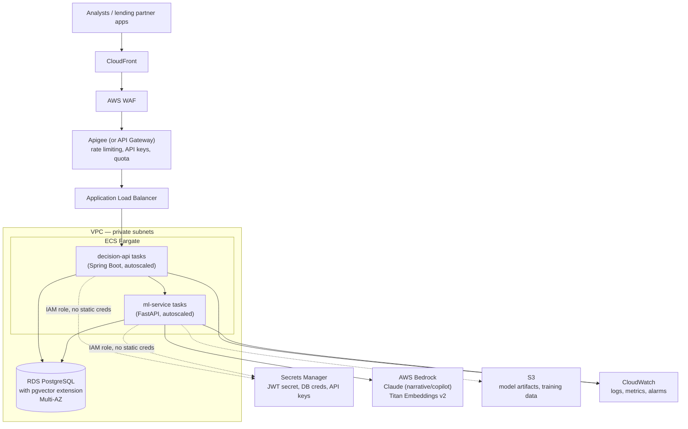

# AWS target architecture

VIGIL is demonstrated locally (docker-compose for Postgres, native processes for the three app
services) — deliberately, to avoid container-networking risk this close to a deadline. This
document is the deployment target it is designed for.

## Component mapping from the local stack

| Local | AWS target | Why |
|---|---|---|
| `docker compose` Postgres | **RDS PostgreSQL, Multi-AZ**, pgvector extension enabled | Managed failover, automated backups; pgvector is supported as an RDS extension |
| `mvn spring-boot:run` / `uvicorn` | **ECS Fargate** tasks behind the ALB, one service each | No server management, scales on CPU/request count, matches the two-service boundary already in the codebase |
| `.env` file | **Secrets Manager**, injected via ECS task IAM role | No secret ever touches a container image or a config file in source control |
| Ollama (local) | **AWS Bedrock** (Claude for narrative/copilot prose, Titan Embeddings v2 for vectors) | Same `LlmProvider`/`EmbeddingProvider` interface already implemented in `ml-service` — switching `LLM_PROVIDER=bedrock` / `EMBEDDING_PROVIDER=bedrock` in config is the entire change, per the provider-interface design |
| Vite dev server | **CloudFront** serving the built React bundle from S3, or an ECS task behind the ALB | Static asset delivery at the edge |
| — | **APIGEE / API Gateway** in front of the ALB | Rate limiting, API key management, request quota — the gateway layer named in the JD's "Java, Spring Boot, APIGEE" skill list |
| — | **AWS WAF** | Standard managed rule sets (SQLi, common exploits) ahead of the application |
| Local model artifacts (`artifacts/*.pkl`) | **S3**, versioned, referenced by `model_registry.version` | Retraining writes a new artifact to S3 and a new registry row; the active model is swapped by config, not redeploy |
| stdout logs | **CloudWatch Logs** + **CloudWatch Alarms** on p95 latency, error rate, and model drift metrics | Operational visibility matching the "monitoring/logging" requirement |

## Security notes for the target deployment
- **No static AWS credentials anywhere** — ECS tasks assume an IAM role; `ml-service`'s
  `BedrockProvider`/`BedrockEmbeddingProvider` (already implemented behind the same interface as the
  Ollama providers) use the standard AWS credential chain, never an access key in `.env`.
- **RDS in private subnets only**, security group restricted to the ECS tasks' security group.
- **Secrets Manager rotation** for the database credential and JWT signing secret.
- **VPC endpoints** for S3 and Secrets Manager so traffic never leaves the AWS network.

## What would change in the code for this migration
Almost nothing. The provider-interface pattern (`LlmProvider`, `EmbeddingProvider` in
`ml-service/app/llm/` and `ml-service/app/embeddings.py`) already has real, structurally-correct
Bedrock implementations behind the same interface as the Ollama ones used in the demo — switching
providers is a `.env` change (`LLM_PROVIDER=bedrock`), not a code change. This was a deliberate
design decision specifically so "AWS Bedrock or equivalent" is truthfully satisfied rather than
hand-waved.
